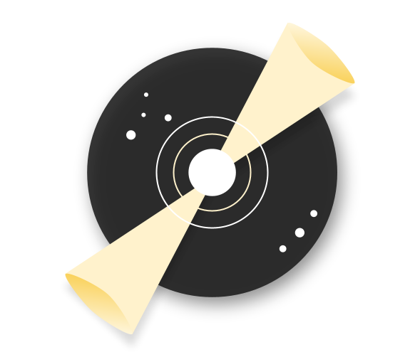

#  Neutron

**Neutron** is a lightweight, high-performance **signal library** for managing event-driven communication in JavaScript and TypeScript applications.  
It provides a simple, intuitive API for creating, subscribing to, and emitting signals, enabling clean decoupling between components.

## ✨ Features
- 🚀 **Lightweight & Fast** – minimal overhead for real-time event handling
- 🛠 **TypeScript Support** – full type safety for events and payloads
- 🔄 **Flexible API** – easy to create, subscribe, and unsubscribe
- 🧩 **Decoupled Architecture** – reduce tight coupling between components
- 🧪 **Test-Friendly** – designed for predictable behavior in unit tests

## Installation

Usage in `packge.json` file

```
"dependencies": {
    "neutron": "https://github.com/shimizacken/neutron/archive/refs/tags/v1.0.1.tar.gz",
  }
}
```

## Usage example

```typescript
const colorsNeutron = createNeutron<string>();

const abandonWatcher = colorsNeutron.watch((next, previous) => {
  console.log("next", next, "previous", previous);
});

colorsNeutron.emit("red"); // next red previous undefined
colorsNeutron.emit("green"); // next green previous red

abandonWatcher();

colorsNeutron.emit("orange"); // no emit

numbersNeutron.watch((num) => {
  console.log(num);
});
```

## 📜 License
MIT
